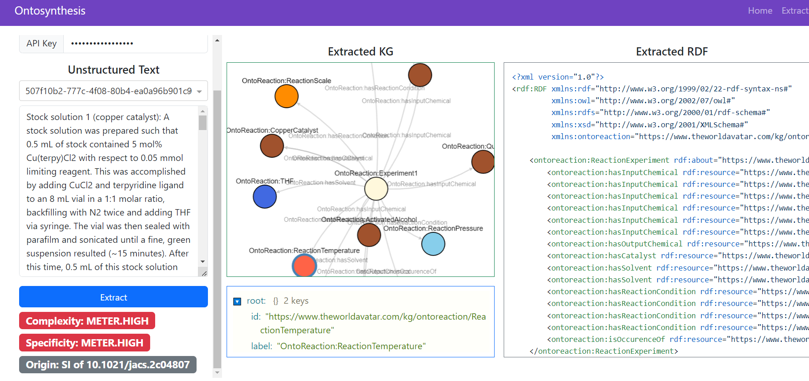

Ontosynthesis: Ontology-based structured data extraction for organic synthesis descriptions.
---

## Motivation
Organic syntheses are often described by unstructured text without a standard taxonomy; this leads to ambiguities and sometimes misleads reproduction.
In a previous study ([repo](https://github.com/qai222/LLM_organic_synthesis), [preprint](https://doi.org/10.26434/chemrxiv-2024-979fz)), 
we fine-tuned LLMs to extract structured reaction data from synthesis procedure text. 
While this method works well for patents, it relies on existing structured data for fine-tuning. 
What if you have a desired ontology/data model but you don't have fine-tuning data?

## Problem definition:
Given an ontology (formally defined concepts and relationships) for organic synthesis, extract structured information from unstructured text using LLMs with zero-to-few-shot prompting.

## 2024 LLM Hackathon:
- [LinkedIn post](https://www.linkedin.com/posts/activity-7194779658658160640-ba34?utm_source=share&utm_medium=member_desktop) by [Jennifer D'Souza](https://www.linkedin.com/in/jennifer-l-dsouza/)
- [Demo video](https://www.loom.com/share/2f045c457fd747179d36d298480cf1e8) by [Kevin Shen](https://www.linkedin.com/in/k-shen/)

This project was proposed in the [2nd LLM Hackathon for Applications in Materials and Chemistry](https://www.eventbrite.com/e/llm-hackathon-for-applications-in-materials-and-chemistry-tickets-868303598437).
During this two-day event we developed an app to extract information as RDF graphs from unstructured synthesis descriptions from a variety of sources including patents, scholarly articles, and lab notebooks.
Our submission was recognized by a runner-up prize thanks to the event sponsor [Reincarnate](https://www.linkedin.com/company/reincarnateai/?lipi=urn%3Ali%3Apage%3Ad_flagship3_detail_base%3B60KP7hB9TTW4CnuJacl1Og%3D%3D).

