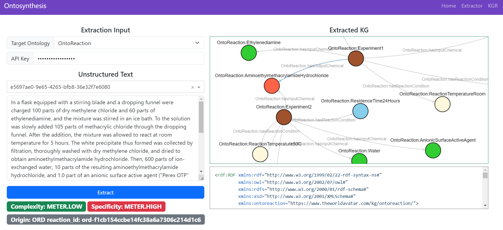

Ontosynthesis: Ontology-based structured data extraction for organic synthesis descriptions.
---

## Motivation
Organic syntheses are often described by unstructured text without a standard taxonomy; this leads to ambiguities and sometimes misleads reproduction.
In a previous study ([repo](https://github.com/qai222/LLM_organic_synthesis), [preprint](https://doi.org/10.26434/chemrxiv-2024-979fz)), 
we fine-tuned LLMs to extract structured reaction data from synthesis procedure text. 
While this method works well for patents, it relies on existing structured data for fine-tuning. 
What if you have a desired ontology/data model but you don't have fine-tuning data?

## Problem definition:
Given an ontology (formally defined concepts and relationships) for organic synthesis, extract structured information from unstructured text using LLMs with zero-to-few-shot prompting.

## 2024 LLM Hackathon:
- [LinkedIn post](https://www.linkedin.com/posts/activity-7194779658658160640-ba34?utm_source=share&utm_medium=member_desktop) by [Jennifer D'Souza](https://www.linkedin.com/in/jennifer-l-dsouza/)
- [Demo video](https://www.loom.com/share/2f045c457fd747179d36d298480cf1e8) by [Kevin Shen](https://www.linkedin.com/in/k-shen/)



This project was proposed in the [2nd LLM Hackathon for Applications in Materials and Chemistry](https://www.eventbrite.com/e/llm-hackathon-for-applications-in-materials-and-chemistry-tickets-868303598437).
During this two-day event we developed an app to extract information as RDF graphs from unstructured synthesis descriptions from a variety of sources including patents, scholarly articles, and lab notebooks.
Our submission was recognized by a runner-up prize thanks to the event sponsor [Reincarnate](https://www.linkedin.com/company/reincarnateai/?lipi=urn%3Ali%3Apage%3Ad_flagship3_detail_base%3B60KP7hB9TTW4CnuJacl1Og%3D%3D).

#### prompt template
The System prompt template is shown in the following snippet with fillable fields defined between chevrons.
This is now hard coded in [app_extractor/extract_openai.py](app_extractor/extract_openai.py)
```manpage
Read the complete specification of the <name of the ontology> ontology in OWL format specified below. Thoroughly understand and remember the provided ontology exactly.

<OWL definition of the ontology>

You are an assistant to structure user provided input text description in OWL/RDF format using the provided ontoreaction ontology above exclusively. You need to generate the OWL instantiation of the text provided by the user. You are strictly instructed to not introduce any hypothetical classes or properties that are not in the ontoreaction ontology specification above. You are strictly also instructed to not assume existence of properties or classes not in the given ontoreaction specification. Simply structure the input from the user with the ontoreaction ontology above, formatted appropriately for OWL representation. Furthermore, do not provide output as an example. Provide an actual structured representation of the text from the user that fit the precise details and terms from the ontoreaction ontology provided for accurate representation that the user can simply import in their ontology management system. The output should be in RDF format inside one xml code block.
```
#### test cases
Test cases are collected in [app_extractor/data/data_hackathon.json](app_extractor/data/data_hackathon.json).

| Test case | Writing style          | Complexity | Specificity |
|-----------|------------------------|------------|-------------|
| 1         | Patent                 | Low        | Medium      |
| 2         | Patent                 | Low        | High        |
| 3         | Journal article        | Low        | Low         |
| 4         | Journal article        | Medium     | Low         |
| 5         | Supporting information | Medium     | High        |
| 6         | Supporting information | High       | High        |
| 7         | Lab notebook           | Low        | High        |
| 8         | Lab notebook           | Low        | High        |
